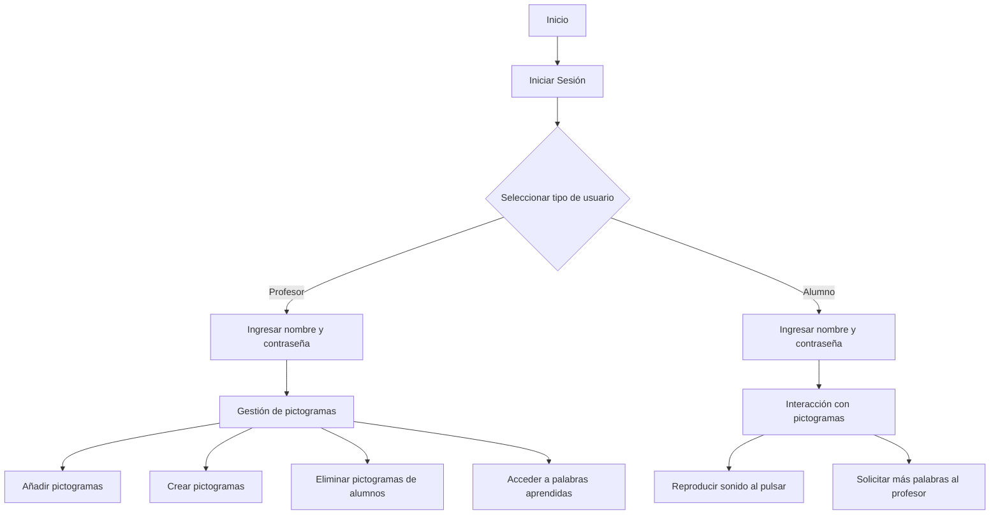
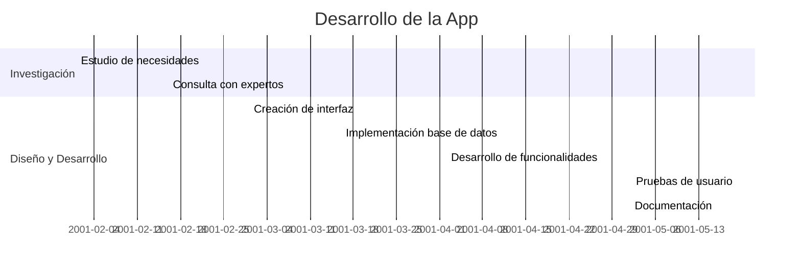
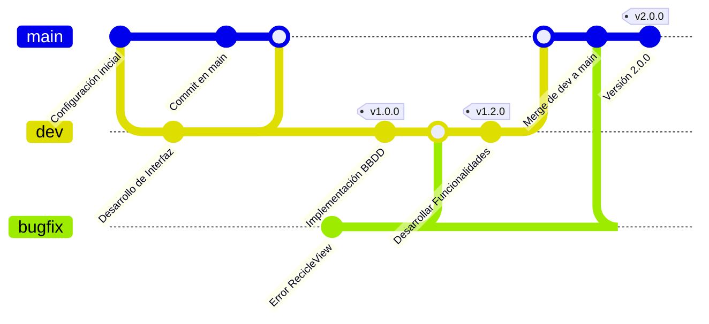
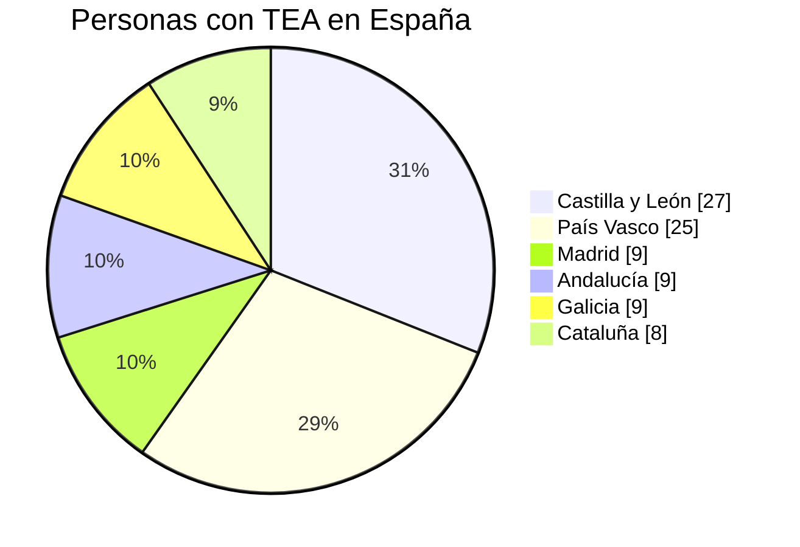
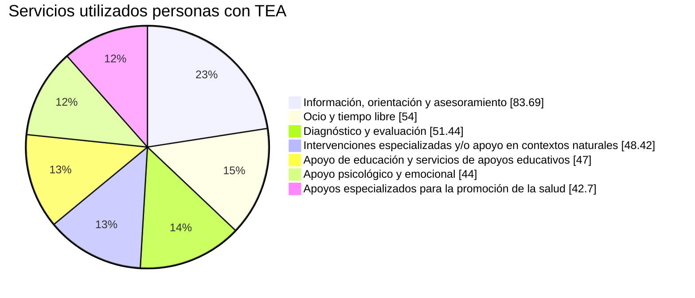
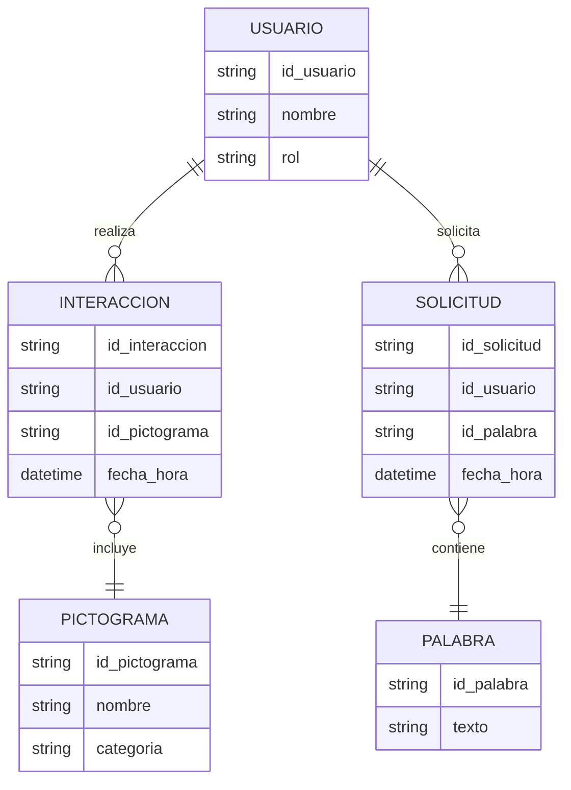
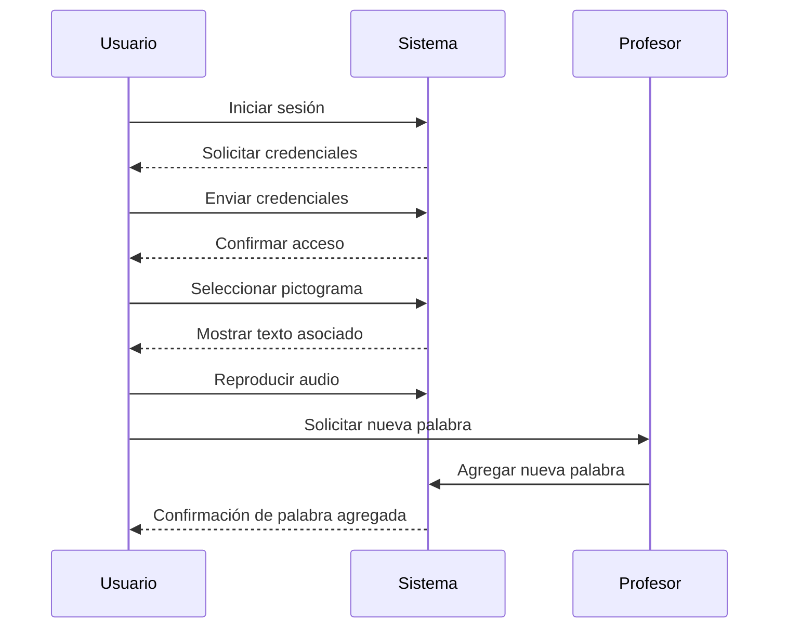
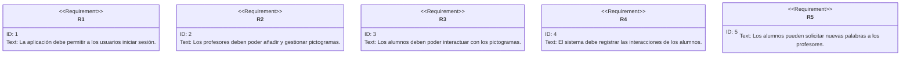
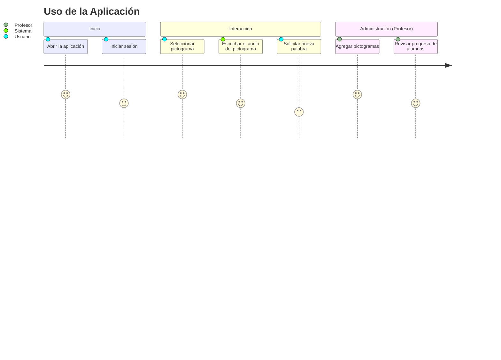

# 📱 App de Comunicación para Personas con Autismo

## 🧩 Introducción

En este proyecto, voy a desarrollar una aplicación móvil diseñada para mejorar la comunicación de personas con autismo a través de una interfaz intuitiva basada en pictogramas. Mi objetivo es facilitar la interacción social y la expresión verbal de los usuarios de la aplicación, proporcionando una herramienta personalizable para entornos escolares.

---

## 🎯 Objetivos

- 🏗 **Crear una interfaz accesible** basada en pictogramas con texto asociado.
- 🎤 **Mejorar la comunicación** y la expresión verbal de los usuarios.
- 📊 **Proporcionar herramientas para maestros**, permitiéndoles gestionar contenido y monitorear el progreso de los estudiantes.

---

## 📌 Características Principales

✅ Interfaz sencilla e intuitiva basada en pictogramas. 
✅ Base de datos sincronizada para almacenar progreso y personalización. 
✅ Módulo administrativo exclusivo para maestros. 
✅ Informes y estadísticas de progreso.

---

## 📊 Tecnologías Utilizadas

| Tecnología | Uso |
|------------|-----|
|  | Desarrollo móvil |
|  | Lenguaje principal |
|  | Base de datos |
|  | Creación Pictogramas |
|  | Desarrollo Interfaz |

---

## 🔄 Flujo de la Aplicación

---

## 📆 Planificación (Diagrama Gantt)

---
## 🐙 Planificación (Diagrama Git)

---
# 📊 Gráficos de Estudio realizado

### Realidad, mitos y retos del autismo
Melisa Tuya, autora del libro ‘Tener un hijo con autismo’ y la psicóloga especialista en personas con 
Asperger, Diana Bohórquez analizan las realidades y los retos a los que se enfrentan diariamente las 
familias y personas con Trastorno de Espectro Autista (TEA). Como madre de un niño con autismo, 
Melisa Tuya insiste en la necesidad de acabar con los falsos mitos sobre este trastorno. “El autismo no es 
una enfermedad. Es una característica de la persona. Tenemos que trabajar para que las personas con 
autismo tengan un potencial máximo y sean felices.”

 

    <a href="https://www.youtube.com/watch?v=0JcUmM63rPI" title="Aprendemos Juntos 2030">Video entrevista a Melisa</a>

##### Fuente
Gestión. (2019, 8 julio). *El estudio sociodemográfico desarrollado por Autismo España cuenta ya con 2.116 registros de personas con TEA*. Autismo España. [https://autismo.org.es/actualidad/noticias/el-estudio-sociodemografico-desarrollado-por-autismo-espana-cuenta-ya-con-2116/?utm_source=chatgpt.com](https://autismo.org.es/actualidad/noticias/el-estudio-sociodemografico-desarrollado-por-autismo-espana-cuenta-ya-con-2116/?utm_source=chatgpt.com)

---
## 📊 Diagrama de Entidad-Relación Provisional

---

## 📜 Diagrama de Secuencia Provisional

---

## 📜 Diagrama de Requerimientos

---
## 📜 Diagrama de Journey

---

## 🤝 Contribuciones

¡Las contribuciones son bienvenidas! Para colaborar:

1. **Escribe tu propuesta** con aquello que has pensado.
2. **Envíalo por correo** al <sehoul@correo.com>.
3. **Nos pondremos en contacto** contigo si nos interesa tu propuesta.

---
